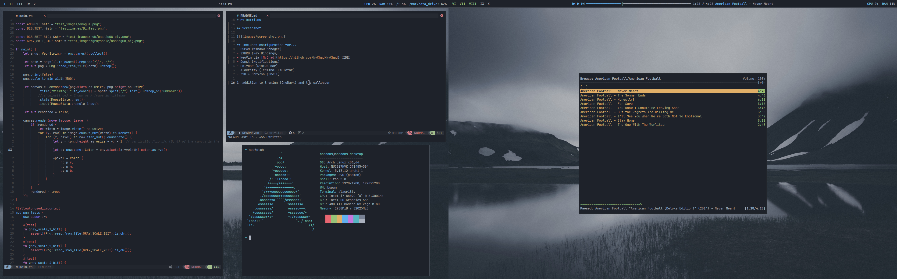

# My Dotfiles

## Screenshot

## Includes configuration for...
- BSPWM (Window Manager)
- SXHKD (Key Bindings)
- NeoVim via [NvChad](https://github.com/NvChad/NvChad) (IDE)
- Dunst (Notifications)
- Polybar (Status Bar)
- Alacritty (Terminal Emulator)
- ZSH + OhMyZsh (Shell)

in addition to theming (OneDark) and the wallpaper
